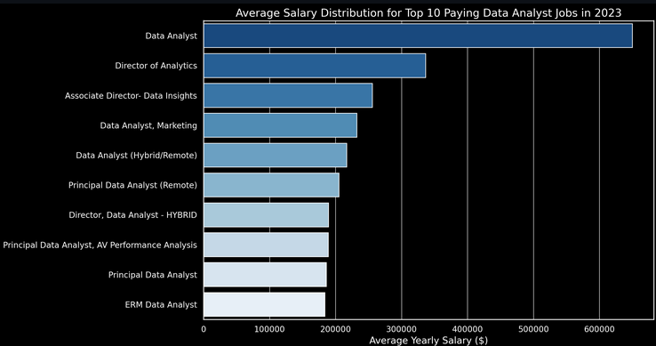
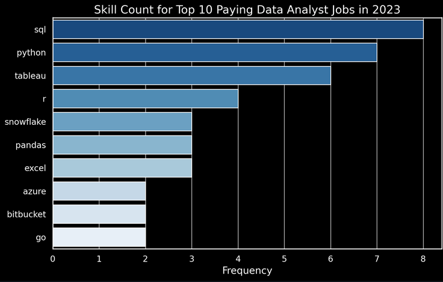

# 📊 Data Analyst Job Market Analysis

## 🎯 Introduction
Dive into the data job market! Focusing on data analyst roles, this project explores **top-paying jobs**, **in-demand skills**, and where **high demand meets high salary** in data analytics.

> 🔍 **Looking for the SQL queries?** Check them out in the [`project_sql`](./project_sql) folder.

---

## 📜 Background
Driven by a quest to navigate the data analyst job market more effectively, this project was born from a desire to pinpoint top-paid and in-demand skills, helping job seekers find optimal opportunities.

The data is sourced from Luke Barousse's **SQL Course**, providing rich insights into job titles, salaries, locations, and the essential skills required in 2023.

### The questions I wanted to answer:
1. What are the top-paying data analyst jobs?
2. What skills are required for these top-paying jobs?
3. What skills are most in demand for data analysts?
4. Which skills are associated with higher salaries?
5. What are the most optimal skills to learn?

---

## 🛠️ Tools I Used
* **SQL:** The backbone of my analysis, allowing me to query the database and unearth critical insights.
* **PostgreSQL:** The chosen database management system, ideal for handling the job posting data.
* **Visual Studio Code:** My primary tool for database management and executing SQL queries.
* **Git & GitHub:** Essential for version control and sharing my SQL scripts and analysis.

---

## 📈 The Analysis

Each query in this project aimed at investigating specific aspects of the data analyst job market.

### 1. Top-Paying Data Analyst Jobs
To identify the highest-paying roles, I filtered data analyst positions by average yearly salary and location, focusing on remote jobs.

```sql
SELECT	
	job_id,
	job_title,
	job_location,
	job_schedule_type,
	salary_year_avg,
	job_posted_date,
    name AS company_name
FROM
    job_postings_fact
LEFT JOIN company_dim ON job_postings_fact.company_id = company_dim.company_id
WHERE
    job_title_short = 'Data Analyst' AND 
    job_location = 'Anywhere' AND 
    salary_year_avg IS NOT NULL
ORDER BY
    salary_year_avg DESC
LIMIT 10;
```

### Insights:

* **Wide Salary Range**: Top 10 paying data analyst roles span from $184 to $650, indicating significant salary potential.

* **Diverse Employers**: Companies like SmartAsset, Meta, and AT&T are among those offering high salaries across industries.

* **Job Title Variety**: High diversity in titles, from Data Analyst to Director of Analytics, reflecting varied specializations.




---

### 2. Skills for Top-Paying Jobs

To understand what skills are required for the top-paying jobs, I joined the job postings with the skills data, providing insights into what employers value for high-compensation roles.

```sql
WITH top_paying_jobs AS (
    SELECT
        job_id,
        job_title,
        salary_year_avg,
        name AS company_name
    FROM
        job_postings_fact
    LEFT JOIN company_dim USING (company_id)
    WHERE
        job_title_short = 'Data Analyst'
        AND job_location = 'Anywhere'
        AND salary_year_avg IS NOT NULL
    ORDER BY
        salary_year_avg DESC
    LIMIT 10
)

SELECT 
    top_paying_jobs.*,
    skills
FROM top_paying_jobs
INNER JOIN skills_job_dim USING (job_id)
INNER JOIN skills_dim USING (skill_id)
ORDER BY 
    top_paying_jobs.salary_year_avg DESC;
```

**Most Demanded Skills for Top 10 Highest-Paying Roles**:

- SQL: Leading with a count of 8.

- Python: Follows closely with a count of 7.

- Tableau: Highly sought after with a count of 6.

- Other skills like R, Snowflake, Pandas, and Excel show varying degrees of demand.





---

### 3. In-Demand Skills for Data Analysts

This query identified the skills most frequently requested in job postings, directing focus to areas with high demand.

```sql
SELECT
    skills,
    COUNT(job_id) AS demand_count
FROM job_postings_fact
INNER JOIN skills_job_dim USING (job_id)
INNER JOIN skills_dim USING (skill_id)
WHERE
    job_title_short = 'Data Analyst' AND
    job_work_from_home = True
GROUP BY skills
ORDER BY demand_count DESC
LIMIT 5;
```

Skills   | Demand Count |
|----------|--------------|
| SQL      | 7291         |
| Excel    | 4611         |
| Python   | 4330         |
| Tableau  | 3745         |
| Power BI | 2609         |
---

### 4. Skills Based on Salary

Exploring the average salaries associated with different skills revealed which skills are the highest paying.

```sql
SELECT
    skills,
    ROUND(AVG(salary_year_avg), 0) AS average_salary
FROM job_postings_fact
INNER JOIN skills_job_dim USING (job_id)
INNER JOIN skills_dim USING (skill_id)
WHERE
    job_title_short = 'Data Analyst' 
    AND salary_year_avg IS NOT NULL
    AND job_work_from_home = True
GROUP BY skills
ORDER BY average_salary DESC
LIMIT 25;
```

| Skills        | Average Salary ($) |
|---------------|-------------------:|
| pyspark       |            208,172 |
| bitbucket     |            189,155 |
| couchbase     |            160,515 |
| watson        |            160,515 |
| datarobot     |            155,486 |
| gitlab        |            154,500 |
| swift         |            153,750 |
| jupyter       |            152,777 |
| pandas        |            151,821 |
| elasticsearch |            145,000 |

**Insights**: 

- Big Data & ML: Highest salaries are commanded by analysts skilled in PySpark, Pandas, and DataRobot.

- DevOps Integration: Proficiency in GitLab and Bitbucket indicates a premium on automation and pipeline management.

- Cloud Expertise: Tools like Elasticsearch and Databricks boost earning potential significantly.

---

### 5. Most Optimal Skills to Learn

Combining demand and salary data, this query pinpoints skills that are both in high demand and offer high salaries.

```sql
WITH skill_demand AS (
  SELECT
    skills,
    skill_id,
    COUNT(skills_job_dim.skill_id) AS demand_count
  FROM job_postings_fact
  INNER JOIN skills_job_dim USING (job_id)
  INNER JOIN skills_dim USING (skill_id)
  WHERE
    job_title_short = 'Data Analyst'
    AND job_work_from_home = True
    AND salary_year_avg IS NOT NULL
  GROUP BY skill_id, skills
), avg_salary AS (
  SELECT
    skills,
    skill_id,
    ROUND(AVG(salary_year_avg), 0) AS average_salary
  FROM job_postings_fact
  INNER JOIN skills_job_dim USING (job_id)
  INNER JOIN skills_dim USING (skill_id)
  WHERE
    job_title_short = 'Data Analyst'
    AND job_work_from_home = True
    AND salary_year_avg IS NOT NULL
  GROUP BY skill_id, skills
)

SELECT
  skill_demand.skill_id,
  skill_demand.skills AS skill,
  skill_demand.demand_count,
  avg_salary.average_salary
FROM skill_demand
INNER JOIN avg_salary USING (skill_id)
WHERE demand_count > 50
ORDER BY demand_count DESC, average_salary DESC
LIMIT 25;
```
| Skill ID | Skills     | Demand Count | Average Salary ($) |
|----------|------------|--------------|-------------------:|
| 8        | go         | 27           |            115,320 |
| 234      | confluence | 11           |            114,210 |
| 97       | hadoop     | 22           |            113,193 |
| 80       | snowflake  | 37           |            112,948 |
| 74       | azure      | 34           |            111,225 |
| 77       | bigquery   | 13           |            109,654 |
| 76       | aws        | 32           |            108,317 |
| 4        | java       | 17           |            106,906 |
| 194      | ssis       | 12           |            106,683 |
| 233      | jira       | 20           |            104,918 |

---
### 🧠 What I Learned

Throughout this adventure, I've turbocharged my SQL toolkit with some serious firepower:

- 🧩 **Complex Query Crafting**: Mastered advanced SQL, merging tables and wielding WITH clauses (CTEs) for clean, efficient code.

- 📊 **Data Aggregation**: Got comfortable with GROUP BY and aggregate functions like COUNT() and AVG() to turn raw data into summaries.

- 💡 **Analytical Wizardry**: Leveled up my real-world puzzle-solving skills, turning business questions into actionable SQL queries.

---
### 🏁 Conclusions

**Insights**

- Top-Paying Jobs: Remote Data Analyst roles can reach staggering salaries, with the peak at $650,000.

- SQL is Essential: It is both the most demanded skill and a prerequisite for high-paying roles. Proficiency here is non-negotiable.

- Specialization is Lucrative: Niche skills like PySpark and Cloud platforms (AWS/Azure) offer a path to the highest salary brackets.

- Optimal Learning Path: Focusing on SQL, Python, and Cloud tools provides the best balance of job availability and financial reward.

---
### Closing Thoughts

This project not only enhanced my technical SQL skills but also provided a clear roadmap for anyone entering the data field. By focusing on high-demand, high-salary skills, aspiring analysts can strategically position themselves in a competitive market. Continuous learning is the key to staying ahead in this evolving landscape.